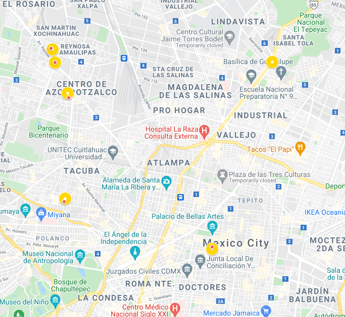
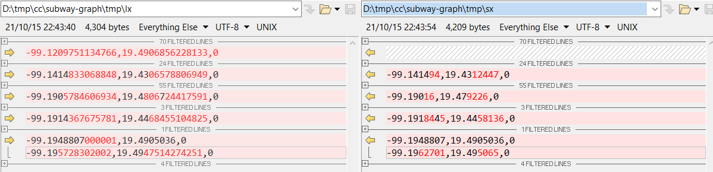

# Subway Challenge

### Example
[El Rosario-Pantitlán](http://localhost:8080/subway/api/v1/route/get?start=El%20Rosario&end=Pantitlán)  
{"lenght":17.0,"path":["El Rosario","Tezozomoc","Azcapotzalco","Ferrería","Norte 45","Vallejo","Instituto del Petróleo","Autobuses del Norte","La Raza","Misterios","Valle Gómez","Consulado","Eduardo Molina","Aragón","Oceanía","Terminal Aérea","Hangares","Pantitlán"]}  

### Errores detectados en el archivo Metro_CDMX.kml
- **Falta "Centro Médico" en la Línea 3**: Sí existe la estación y está asociada a la Línea 9 pero no existen las coordenadas en el listado de la Línea 3 (ni una cercana).
- **Hay varios puntos que no coinciden exactamente**: Pero sí tienen su correspondiente punto cercano. Se implementó un mecanísmo para calcular un márgen de tolerancia basado en la distancia euclidiana.  
  
[Ver mapa](https://www.google.com/maps/d/u/0/edit?mid=1lZmHGontCqxqGFpb6p1KxlZKCUCFXCGO&usp=sharing)  
  
- **Hay un punto entre "Indios Verdes" y "Deportivo 18 de Marzo" que no corresponde a ninguna estación**: Simplemente se ignoró. El punto es `-99.1209751134766,19.4906856228133,0`.
- **No existen las siguientes estaciones:** Ecatepec,

### Notes
- Se agrega el json respuesta del endpoint http://localhost:8080/subway/api/v1/map/list con todas las líneas y todas las estaciones. [JSON](metro_map.json)

### References
https://en.wikipedia.org/wiki/List_of_Mexico_City_Metro_stations
https://metro.cdmx.gob.mx/storage/app/media/red/plano_red19.pdf

https://jgrapht.org/guide/UserOverview#hello-jgrapht
https://jgrapht.org/javadoc/org.jgrapht.core/org/jgrapht/graph/AsUnweightedGraph.html

SimpleWeightedGraph	undirected	no	no	yes  
SimpleGraph	undirected	no	no	no

### Future Work
- Minimum distance algorithm (Eco friendly).
	- Euclidean as weight in edges.
- Minimum transfers algorithm.
	- Manage each shared station part of diferent lines as diferent stations and set a weight for transfers between them.