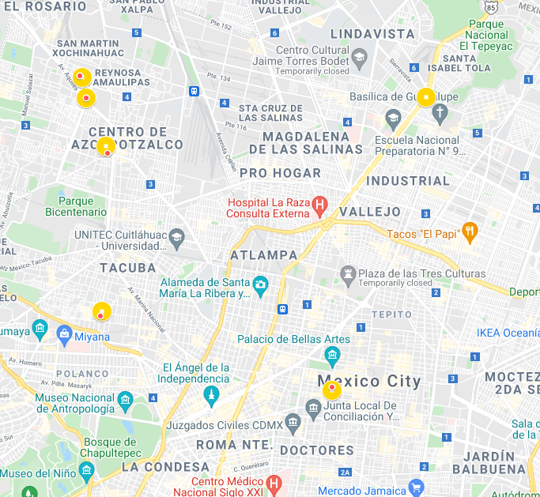
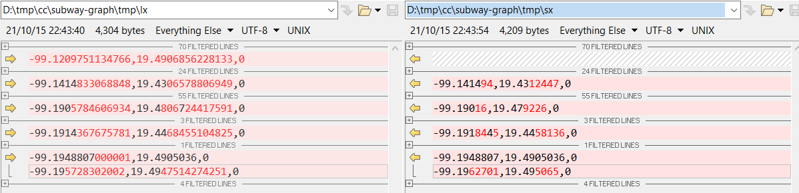

# Mexico City Metro Challenge

### Notes
[Instructions](_release/Mexico_City_Metro_Challenge.md)  

- Use [**/itinerary/pretty**](http://localhost:8080/subway/api/v1/itinerary/pretty?start=Iztapalapa&end=La%20Raza) for a human redeable visualization.  
- Also you could use the Postman Collection with all the following endpoints and their responses [subway.postman_collection.json](_release/subway.postman_collection.json)  
- Compile the project with `mvn clean package` command.  
- The JAR file was also attached, so you could use it to run the application with the command:  
```
java -jar _release/subway-graph-1.0.0.jar
```

### Solutions
- Stage 1: [**/map/list**](http://localhost:8080/subway/api/v1/map/list)
- Stage 2: [**/itinerary/pretty**](http://localhost:8080/subway/api/v1/itinerary/pretty?start=Iztapalapa&end=La%20Raza)
- Stage 3: [**Swagger Documentation**](http://localhost:8080/subway/api/v1/swagger-ui.html#/main-controller)

### Docs
[Class Diagram](https://gitlab.bunsan.io/angel.garcia/subway-graph/-/blob/master/_release/SubwayGraphClassDiagram.png)

### Detected errors in the file Metro_CDMX.kml
- **Missed "Centro Médico" in the Line 3**: The station does exist and it is associated with Line 9 but there are no coordinates in the list of Line 3 (nor a nearby one).
- **There are several points that do not coincide exactly**: But they do have a corresponding close point. A mechanism was implemented to calculate a margin of tolerance based on the Euclidean distance.
  
[See map](https://www.google.com/maps/d/u/0/edit?mid=1lZmHGontCqxqGFpb6p1KxlZKCUCFXCGO&usp=sharing)  
  
- **There is a point between "Indios Verdes" and "Deportivo 18 de Marzo" that does not correspond to any station**: It was simply ignored. The point is `-99.1209751134766.19.4906856228133.0`.
- **The following stations do not exist:** Ecatepec, Buenavista

### Endpoints
- **API Docs**: [Swagger Documentation](http://localhost:8080/subway/api/v1/swagger-ui.html#/main-controller) 
- **/map/list**: [JSON](_release/map_list.json)
- **/map/index**: [JSON](_release/map_index.json)
- **/route/get**: [El Rosario-La Raza](http://localhost:8080/subway/api/v1/route/get?start=El%20Rosario&end=Pantitlán)  
```
{
    "path": [
        "El Rosario",
        "Tezozomoc",
        "Azcapotzalco",
        "Ferrería",
        "Norte 45",
        "Vallejo",
        "Instituto del Petróleo",
        "Autobuses del Norte",
        "La Raza"
    ],
    "direction": null
} 
```
- **/itinerary/get**: [La Paz-Mixcoac](http://localhost:8080/subway/api/v1/itinerary/get?start=La%20Paz&end=Mixcoac)  
```
{
    "segments": [
        {
            "path": [
                "La Paz",
                "Los Reyes",
                "Santa María",
                "Acatitla",
                "Peñón Viejo",
                "Guelatao",
                "Tepalcates",
                "Canal de San Juan",
                "Agrícola Oriental",
                "Pantitlán"
            ],
            "direction": "Pantitlán"
        },
        {
            "path": [
                "Pantitlán",
                "Zaragoza",
                "Gómez Farías",
                "Boulevard Puerto Aéreo",
                "Balbuena",
                "Moctezuma",
                "San Lázaro",
                "Candelaria",
                "Merced",
                "Pino Suárez",
                "Isabel la Católica",
                "Salto del Agua",
                "Balderas",
                "Cuauhtémoc",
                "Insurgentes",
                "Sevilla",
                "Chapultepec",
                "Juanacatlán",
                "Tacubaya"
            ],
            "direction": "Observatorio"
        },
        {
            "path": [
                "Tacubaya",
                "San Pedro de los Pinos",
                "San Antonio",
                "Mixcoac"
            ],
            "direction": "Barranca del Muerto"
        }
    ]
} 
```
- **/itinerary/pretty**: [Tlaltenco-Norte 45](http://localhost:8080/subway/api/v1/itinerary/pretty?start=Tlaltenco&end=Norte%45)  
```
Starting at "Tlaltenco" follow the next steps:
From "Tlaltenco" go direction to "Mixcoac" for 10 stations until "Atlalilco" :: [Tlaltenco, Zapotitlán, Nopalera, Olivos, Tezonco, Periférico Oriente, Calle 11, Lomas Estrella, San Andrés Tomatlán, Culhuacán, Atlalilco]
From "Atlalilco" go direction to "Garibaldi" for 6 stations until "Santa Anita" :: [Atlalilco, Escuadrón 201, Aculco, Apatlaco, Iztacalco, Coyuya, Santa Anita]
From "Santa Anita" go direction to "Martin Carrera" for 6 stations until "Consulado" :: [Santa Anita, Jamaica, Fray Servando, Candelaria, Morelos, Canal del Norte, Consulado]
From "Consulado" go direction to "Politécnico" for 5 stations until "Instituto del Petróleo" :: [Consulado, Valle Gómez, Misterios, La Raza, Autobuses del Norte, Instituto del Petróleo]
From "Instituto del Petróleo" go direction to "El Rosario" for 2 stations until "Norte 45" :: [Instituto del Petróleo, Vallejo, Norte 45]
You have arrived to "Norte 45" !!!
```

### References
https://gist.github.com/MachinesAreUs/a28c0173fd0d4a57d534129d9d6bcafb  
https://en.wikipedia.org/wiki/List_of_Mexico_City_Metro_stations  
https://metro.cdmx.gob.mx/storage/app/media/red/plano_red19.pdf  
https://jgrapht.org/guide/UserOverview#hello-jgrapht  

### Future Work
- Minimum distance algorithm (Eco friendly).
	- Euclidean as weight in edges.
- Minimum transfers algorithm.
	- A posible implementarion could be managing each shared station part of diferent lines as diferent stations and set a weight for transfers between them.